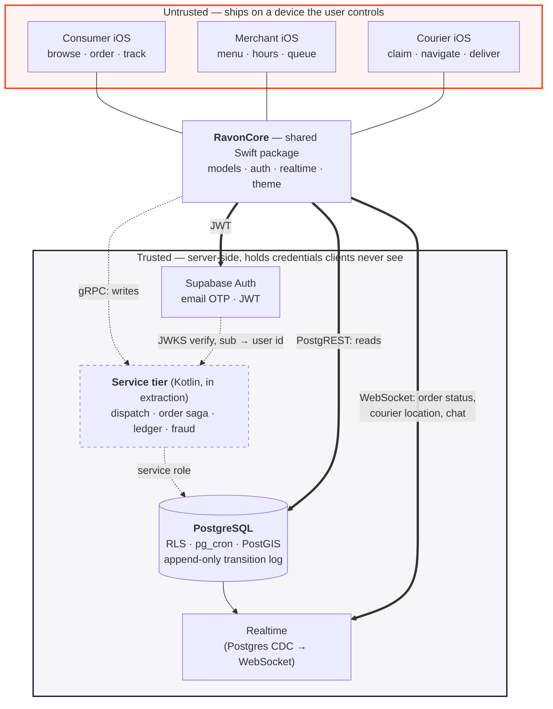

# Ravon

A three-sided food-delivery marketplace for Dushanbe, Tajikistan — consumer, merchant and
courier iOS apps over one shared Swift package, a PostgreSQL data model, and a dispatch
engine that assigns couriers to orders as a minimum-cost matching problem rather than a
first-come-first-served job board. This repository is `RavonCore`: the shared package, the
dispatch engine and its evaluation harness, the order lifecycle model, and the CI gates.
The service tier is **currently being extracted to Kotlin/gRPC** and does not exist yet.

The interesting part of a delivery marketplace is not the CRUD. It is deciding which
courier gets which order, proving that decision is correct, and measuring whether it is
actually better — under conditions you can state.

---

## Measured results

Every number below was produced by running the code in this repository. Each is stated
with the caveat that bounds it, because a number without its conditions is not a result.

### Dispatch: minimum-cost matching vs. greedy FCFS

30 seeds · 12 couriers · 240 orders · 180-minute window, in a deterministic simulator:

| metric | result |
|---|---|
| orders assigned to a courier | **+44.6%** (min +29.9%, max +53.8%) |
| mean **modeled** delivery time | **−45.3%** (range −51.7% to −39.7%) |
| total courier travel | −1.1% mean — but the worst seed is **+2.1%** |
| seeds where matching won | **30 / 30**, strictly |

**Caveat, and it is the important half: the advantage is a function of courier scarcity
and vanishes entirely once supply exceeds demand.** Holding demand at 240 orders, seed 42:

| couriers | greedy | matching | gain |
|---|---|---|---|
| 6 | 63 | 100 | **+58.7%** |
| 12 | 115 | 162 | +40.9% |
| 24 | 234 | 240 | +2.6% |
| 48 | 240 | 240 | **0.0%** |

This is a peak-load optimisation — worth a great deal at the dinner rush and nothing on a
slow Tuesday. It is pinned as a test so nobody later tunes dispatch for a regime where it
cannot matter.

**Second caveat: these are simulator numbers, not delivery times.** Distance is
straight-line Haversine with no road network, kitchen prep is drawn from a uniform
distribution, and couriers never decline an offer. The *comparison* is sound because both
strategies run in the identical world; the absolute minutes are not an ETA.

**Third caveat: "on less fuel" would be an overclaim.** The mean travel difference is
−1.1%, but the per-seed spread crosses zero. "No measurable travel penalty" is what the
data supports.

→ [Full study](docs/dispatch-engine.md) · [ADR 0002](docs/adr/0002-min-cost-matching-over-greedy.md)

### Experiment design: measuring the bias of A/B designs against ground truth

A simulator can do what production cannot — run the whole world on algorithm A, then on
algorithm B with the same seed, so the *true* effect is known and each experiment design's
bias can be measured rather than argued about.

| dispatch partition | true lift | naive A/B mean \|bias\| | switchback mean \|bias\| |
|---|---|---|---|
| none | 21.1 pts | 23.3 pts | 22.3 pts |
| 3×3 zones | 1.9 pts | **3.0 pts** | **3.3 pts** |

Both designs were initially biased by more than the entire effect they were estimating.
The cause was not interference between arms — it was a **granularity mismatch**: a batch
optimiser's effect is a property of the whole dispatch decision, so splitting orders
between arms measures a different algorithm. Making dispatch itself run per zone cut
absolute bias about **7×**.

**Caveat 1 — the negative result.** At this scale, once dispatch is zone-partitioned,
plain order-level randomisation is about as unbiased as a switchback. This does not
reproduce DoorDash's headline; it localises why switchbacks matter (densely coupled
markets with real carryover between time blocks, which 12 couriers over 9 zones is not).

**Caveat 2 — relative bias got *worse*.** Absolute bias fell 23.3 → 3.0 points, but the
true effect fell 21.1 → 1.9 at the same time. As a fraction of the effect, bias went from
~1.1× to ~1.6×.

**Caveat 3 — zones cost optimality.** That shrinking true effect is the third finding:
partitioning 3×3 cost most of the optimiser's advantage, because a courier cannot serve
an adjacent zone even when they are closest.

→ [Full study](docs/experiment-design-study.md) · [ADR 0004](docs/adr/0004-zone-partitioning.md)

### Correctness properties

| property | how it is established |
|---|---|
| The matcher returns the true optimum | exhaustive permutation search over 300 random matrices, exact equality |
| The order lifecycle graph is live | 17 property-based invariants over a declared 36-edge, 17-state, 4-actor transition table |
| The graph is cyclic, and termination is not free | Tarjan SCC pass found exactly one cycle — courier cancellation requeues the order — so termination depends on a server-side rate limit, which is now asserted |
| Simulations are reproducible | same seed ⇒ identical assignments, delivery times, travel and per-courier job counts |

The lifecycle suite caught a modelling error in its own author's first version of the
transition table. That is the argument for declaring the state machine as data.

### Provenance of these numbers

Measured against the working tree of branch `mmarufov/bucharest-v9`, parent commit
[`737911a`](https://github.com/mmarufov/ravon-core/commit/737911a). **The dispatch sources
and their tests are not yet committed at that SHA** — they are untracked in the working
tree. Once they land, this line should cite the dispatch commit instead. Figures have
drifted as the simulator changed (an earlier draft recorded +42.2%); the numbers above are
what `swift test` and the simulator produce today, and they replace the earlier ones.

---

## Architecture

Solid lines exist. Dashed lines do not.



Four things this diagram is trying to say:

1. **The trust boundary is the box, not the network hop.** Everything above it runs on
   hardware the user owns, so every value it sends is an assertion. The anon key it ships
   with is public client config; anything reachable with it must be safe against `curl`.
   Row-level security stays on after the service tier lands — it becomes defence in depth
   rather than the only gate.
2. **Two transports, on purpose.** Commands need global state and transactional integrity,
   so they go to the service tier. Reads and subscriptions stay on PostgREST and Postgres
   CDC because those already work and rebuilding them buys nothing. This is what an
   incremental extraction looks like partway through.
3. **Dispatch is currently in the wrong place** — it lives in the *client* package, and a
   phone cannot see the other couriers. It is there because that is where it could be
   built and measured. It is the first thing that moves.
4. **Realtime is change-data-capture, not a second source of truth.**

→ [Diagram notes](docs/architecture.md) · [ADR 0005](docs/adr/0005-extract-to-kotlin-not-rewrite.md)

---

## What's real, what's simulated, what's not built

Stating this boundary is the point. The dispatch numbers mean something specific and it
is easy to read them as meaning more.

### Real — code in this repository, exercised by tests

| | Evidence |
|---|---|
| Shared Swift package: models, auth, realtime, theme | `Sources/RavonCore/` — 43 files, 7,454 lines |
| Hungarian solver, verified optimal against brute force | `Dispatch/HungarianSolver.swift`, 300 matrices |
| Cost model with capped urgency and fairness credits | `Dispatch/Dispatcher.swift` |
| Deterministic marketplace simulator with latent state | `Dispatch/MarketplaceSimulator.swift` |
| Zone partitioning and the switchback harness | `Dispatch/{DispatchZone,SwitchbackExperiment}.swift` |
| 17-state, 36-edge, 4-actor declared transition table | `Models/OrderLifecycle.swift` |
| 17 property-based lifecycle invariants incl. Tarjan SCC | `Tests/.../OrderLifecycleInvariantTests.swift` |
| Email-OTP auth flow, typed errors, shared SwiftUI | `UI/Auth/` |
| Schema-drift and JWT-decoding credential CI gates | `scripts/` |
| 163 tests, all passing | `swift test` |

### Simulated — real code, synthetic world

| | What that means |
|---|---|
| Every dispatch and experiment number in this README | Produced by `MarketplaceSimulator`, not by couriers |
| Travel time | Haversine ÷ a fixed speed. No roads, no traffic, no turns |
| Kitchen prep time | Uniform random, not learned |
| Courier behaviour | An assigned courier always accepts. Real couriers decline |
| Order arrivals | Synthetic, clustered around a modelled city centre |

### Not built

| | Status |
|---|---|
| Kotlin / gRPC service tier | No `services/` directory. Planned; [ADR 0005](docs/adr/0005-extract-to-kotlin-not-rewrite.md) |
| Protobuf contracts and compatibility gate | Planned |
| Double-entry ledger | No schema, no tests, no CI job at the documented commit. A concurrent effort has scaffolded `db/ledger/`, but it currently holds only a Python virtualenv |
| Probabilistic ETA, forecasting, anomaly detection | Not verified here. A concurrent effort is building a Python layer under `ml/`; nothing in this README depends on it |
| Batching (multiple orders per courier) | Not modelled — the largest gap vs. the reference architecture |
| Courier acceptance probability | Not modelled. There is no `courier_decline_order` RPC |
| Dispatch wired to the app | The engine and its evaluation exist; no `dispatch_tick`, still `claim_order` |

### No running backend

**The Supabase project behind this system has been deleted.** The host returns NXDOMAIN
and the Management API returns 404 "Resource has been removed" for the project ref. The
three iOS apps are backend-less. Nothing here can be run against live data.

Consequences worth knowing:

- The 19 SQL migrations live in `.context/`, which is gitignored, so they are not in this
  repository. They were also an incomplete record even when the project existed: 14 of 15
  tables touched by Swift were never created by a migration, and six Postgres enums were
  created through the dashboard.
- The `schema-drift` CI job reads `.context/migrations` and therefore **cannot pass on
  GitHub** as currently written. It passes locally, where the directory exists.
- The three iOS app repositories (consumer, merchant, courier) are separate and not part
  of this repo, so nothing here verifies their contents.

The best incident story in the project came from this: when the backend disappeared, the
apps rendered "backend deleted" and "no orders today" identically. A typed service state
that distinguishes *degraded* from *empty* is the fix, and it is not built either.

---

## Running it

```bash
swift build
swift test                                  # 163 tests: 102 XCTest + 61 swift-testing
```

Targeted suites:

```bash
swift test --filter 'Dispatch|Hungarian'    # 15 — dispatch quality and solver optimality
swift test --filter 'Switchback'            #  7 — experiment-design bias study
swift test --filter 'OrderLifecycle'        # 17 — state-machine invariants
```

Requires Swift 5.9+, iOS 17+ / macOS 14+. The only third-party dependency is
[`supabase-swift`](https://github.com/supabase/supabase-swift).

### CI gates

Five jobs in `.github/workflows/ci.yml`. Each exists because of a specific class of defect:

| job | catches |
|---|---|
| `test` | ordinary regressions, across the whole suite |
| `lifecycle-invariants` | a state-machine change that breaks liveness or visibility — a marketplace correctness bug, not a flaky test |
| `dispatch-quality` | dispatch getting worse for real couriers, which no unit test would notice |
| `schema-drift` | Swift `CodingKeys` diverging from the SQL columns. Not a compile error, not a test failure — a **decode crash in a shipped iOS app** |
| `secret-scan` | a committed `service_role` JWT, which would be a full database compromise. Decodes every JWT and inspects the `role` claim rather than grepping for a word that legitimately appears in docs |

Two honest notes. The workflow file is **untracked at the documented commit, so CI has
never actually run** — there is no green badge to point at, and that is why there is no
badge in this README. And `schema-drift` will fail on GitHub until the migrations are
tracked, for the reason given above.

Both scripts run locally:

```bash
python3 scripts/schema_drift.py    # 0 drift, 15 unverified
python3 scripts/scan_secrets.py .  # clean
```

---

## Deliberately not built

Each rejection carries the threshold that would reverse it, because a rejection without a
threshold is an excuse. Full reasoning in
[ADR 0007](docs/adr/0007-rejected-technologies.md).

| | Why not | Would become justified when |
|---|---|---|
| **Gurobi** | Single-order assignment is solved *exactly* by the Hungarian algorithm in microseconds; a commercial solver cannot beat optimal | Batching enters the model — then it is a vehicle-routing problem and the exact algorithm no longer applies. Try OR-Tools first |
| **Kafka** | The guarantees — durability, ordering, replay, fan-out — are implemented on an append-only Postgres table plus CDC. Transactional emission is *better* this way: one write, no outbox | Multiple extracted services exchanging events, or sustained rates above ~5,000/s. Current arithmetic: ~2.5/s |
| **Cassandra** | Every entity needs multi-row transactions; the ledger wants a deferred constraint at COMMIT, which has no Cassandra equivalent | Write throughput one tuned Postgres primary cannot absorb, after partitioning and read replicas |
| **Service mesh** | One deployable today, at most four after the extraction. gRPC's own TLS, deadlines and retries cover it in config | ~10+ services, or more than two languages in the service tier |
| **Feature store** | It prevents training/serving skew. There is no serving path, so skew cannot occur | The same feature is computed in both an offline job and an online request path |
| **Bazel** | ~7,500 lines in one SwiftPM target; a clean build is seconds | CI wall-clock consistently over ~15 min with no cheaper fix left |

The **monorepo** idea is separately correct and is being adopted; a distributed build
system is a different decision that often gets conflated with it.

---

## Architecture Decision Records

Each one states the problem, the options weighed, what was chosen, and what it cost.

| # | Decision |
|---|---|
| [0001](docs/adr/0001-order-lifecycle-as-declared-data.md) | Model the order lifecycle as declared data, not scattered status checks |
| [0002](docs/adr/0002-min-cost-matching-over-greedy.md) | Solve dispatch as minimum-cost matching, and do not minimise distance |
| [0003](docs/adr/0003-deterministic-simulation-as-evaluation.md) | Evaluate dispatch by deterministic simulation, with latent state |
| [0004](docs/adr/0004-zone-partitioning.md) | Zone partitioning: tractability *and* measurability, at a real cost |
| [0005](docs/adr/0005-extract-to-kotlin-not-rewrite.md) | Extract a Kotlin service tier; do not rewrite the backend — **proposed, not built** |
| [0006](docs/adr/0006-postgres-over-kafka.md) | Implement the event guarantees on Postgres, not on Kafka |
| [0007](docs/adr/0007-rejected-technologies.md) | Technologies deliberately not used, and what would change that |

## Further reading

- [Dispatch engine — design, results, limitations](docs/dispatch-engine.md)
- [Experiment design under interference](docs/experiment-design-study.md)
- [DeepRed — what DoorDash runs, and how Ravon compares](docs/deepred-research.md)
- [Architecture diagram and notes](docs/architecture.md)

## Using the package

```swift
import RavonCore

RavonCore.configure(
    supabaseURL: URL(string: "https://YOUR-PROJECT.supabase.co")!,
    supabaseAnonKey: "YOUR_ANON_KEY"   // inject from .xcconfig / Secrets.plist / CI secret
)
```

Configure once at launch, before any service is touched. The anon key is public client
config, but credentials still do not belong in source control — which is what the
`secret-scan` gate enforces. A `service_role` key must never appear in client code, a
mobile binary, tracked docs or repo config, including in a private repo.

UI strings are Russian (Cyrillic). Brand colour is `#FF3008`.
