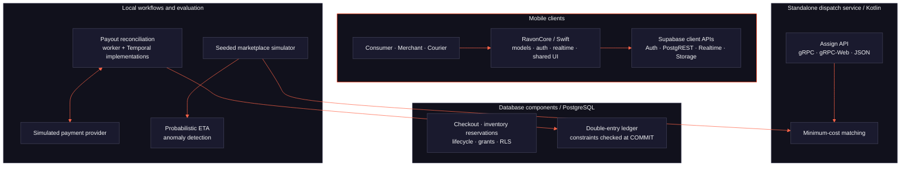

<div align="center">

# Ravon

**The food-delivery platform built for the dinner rush.**

Smart dispatch · Native iOS · Transactional checkout · Payout recovery

[](https://github.com/mmarufov/ravon-core/actions/workflows/ci.yml)
[](Sources/RavonCore/)
[](services/)
[](db/schema/)

[Live API](https://ravon-api.fly.dev/docs/) · [Architecture](#architecture) · [Engineering](#engineering-decisions) · [Getting started](#getting-started)

</div>

---

Ravon is a food-delivery platform with dedicated iOS apps for customers, restaurants,
and couriers. A shared Swift package connects the three, alongside a Kotlin dispatch
engine, PostgreSQL checkout and ledger components, and probabilistic delivery-time models.

The dinner rush is the design case: more orders than available couriers, customers
competing for the last portions, and payment requests that can succeed even when the
reply never arrives. Ravon tackles each with a specific algorithm or transaction model,
then tests it under the conditions that could break it.

## Highlights

- **Better use of available couriers.** Dispatch solves the whole batch, balancing travel,
  kitchen wait, order urgency, and courier idle time. Seeded simulations assign 44.6% more
  orders than greedy dispatch with the same fleet.
- **Stock reserved at checkout.** Orders, inventory reservations, and scheduled kitchen
  capacity are handled in one database transaction. A concurrent load test sends 1,000
  buyers after 40 portions and verifies that exactly 40 sell.
- **Money with an audit trail.** The ledger checks balanced entries at commit, identifies
  repeated requests, and records corrections as reversals. Payout recovery reconciles a
  lost reply against provider status before deciding what happens next.
- **Three native apps, one shared core.** Customer ordering, restaurant operations, and
  courier delivery use common models, authentication, realtime services, and UI components.
- **Results you can reproduce.** Versioned fixtures, committed experiment data, and CI
  checks connect the published numbers to the code that produces them.

## By the numbers

| Component | Evidence | Evaluation |
| :--- | :--- | :--- |
| **Courier matching** | **44.6% more orders assigned** and **45.3% lower mean modeled delivery time** than greedy dispatch | 30 seeded simulations; 12 couriers, 240 orders, 180 minutes. [Study](docs/dispatch-engine.md) |
| **Concurrent checkout** | **40 portions sold to 1,000 concurrent pre-order attempts**, with zero oversells in all 10 trials | Local PostgreSQL load test through the real `create_order` function. [Results](db/rush/RESULTS.md) |
| **Ledger integrity** | Balance and atomicity checks pass while **18 PostgreSQL backends are terminated** during the suite | Real database transactions; kills counted independently from server statistics. [Run record](docs/results/2026-09-30-reproducibility.md#ledger-suite-and-kill-count) |
| **Probabilistic ETA** | **55.8% lower CRPS** than the naive time estimate; **80.4% coverage** for an 80th-percentile quote | Offline evaluation with training/test splits by whole simulated day. [Models and results](ml/README.md#headline-results) |

Dispatch and ETA figures come from simulated orders; checkout and ledger results come
from local PostgreSQL tests. Each linked report includes its setup and measurement scope.

## Try the dispatch API

The hosted service accepts gRPC, gRPC-Web, and JSON. Explore it in the
[API console](https://ravon-api.fly.dev/docs/) or send a request with `curl`. No account is
required.

<details>
<summary><strong>Try a two-courier assignment</strong></summary>

```bash
curl --fail --silent --show-error https://ravon-api.fly.dev/ravon.dispatch.v1.DispatchService/Assign \
  -H 'Content-Type: application/json' -d '{
  "now": "2026-10-01T12:00:00Z",
  "couriers": [
    {"courierId": "00000000-0000-0000-0000-00000000000a",
     "location": {"latitude": 38.56, "longitude": 68.770},
     "idleSince": "2026-10-01T11:50:00Z"},
    {"courierId": "00000000-0000-0000-0000-00000000000b",
     "location": {"latitude": 38.56, "longitude": 68.862},
     "idleSince": "2026-10-01T11:50:00Z"}
  ],
  "orders": [
    {"orderId": "00000000-0000-0000-0000-000000000001",
     "createdAt": "2026-10-01T11:45:00Z", "readyAt": "2026-10-01T12:10:00Z",
     "pickup": {"latitude": 38.56, "longitude": 68.793},
     "dropoff": {"latitude": 38.57, "longitude": 68.80}},
    {"orderId": "00000000-0000-0000-0000-000000000002",
     "createdAt": "2026-10-01T11:58:00Z", "readyAt": "2026-10-01T12:10:00Z",
     "pickup": {"latitude": 38.56, "longitude": 68.760},
     "dropoff": {"latitude": 38.55, "longitude": 68.75}}
  ]
}'
```

The response assigns courier **A to order 2** and courier **B to order 1**.
A can reach either restaurant; B can reach only order 1 within the assignment radius.
Giving A the older order first leaves order 2 waiting. Matching the batch serves both.

`costMinutes` includes travel, kitchen wait, and capped urgency and idle-time credits;
negative values are valid. The request supplies `now` explicitly, making the computation
replayable without depending on a server clock.

</details>

[Protobuf contract](proto/ravon/dispatch/v1/dispatch.proto) · [Health endpoint](https://ravon-api.fly.dev/health)

---

## Architecture


```mermaid
%%{init: {"theme":"base","themeVariables":{
  "primaryColor":"#1A1A2E","primaryTextColor":"#F4F5F7","primaryBorderColor":"#424259",
  "lineColor":"#FF6549","textColor":"#F4F5F7","fontSize":"14px",
  "clusterBkg":"#11111C","clusterBorder":"#424259"
}}}%%
flowchart TB
    subgraph mobile["Mobile clients"]
        APPS["Consumer · Merchant · Courier"]
        CORE["RavonCore / Swift<br/>models · auth · realtime · shared UI"]
        APPS --> CORE
        CORE --> SUPA["Supabase client APIs<br/>Auth · PostgREST · Realtime · Storage"]
    end

    subgraph dispatch["Standalone dispatch service / Kotlin"]
        API["Assign API<br/>gRPC · gRPC-Web · JSON"]
        MATCH["Minimum-cost matching"]
        API --> MATCH
    end

    subgraph database["Database components / PostgreSQL"]
        ORDERS["Checkout · inventory reservations<br/>lifecycle · grants · RLS"]
        LEDGER["Double-entry ledger<br/>constraints checked at COMMIT"]
    end

    subgraph evaluation["Local workflows and evaluation"]
        PAYOUT["Payout reconciliation<br/>worker + Temporal implementations"]
        PROVIDER["Simulated payment provider"]
        SIM["Seeded marketplace simulator"]
        ML["Probabilistic ETA<br/>anomaly detection"]
        PAYOUT --> LEDGER
        PAYOUT <--> PROVIDER
        SIM --> MATCH
        SIM --> ML
    end

    classDef node fill:#1A1A2E,stroke:#424259,color:#F4F5F7
    class APPS,CORE,SUPA,API,MATCH,ORDERS,LEDGER,PAYOUT,PROVIDER,SIM,ML node
    style mobile fill:#11111C,stroke:#FF3008,color:#F4F5F7
    style dispatch fill:#11111C,stroke:#424259,color:#F4F5F7
    style database fill:#11111C,stroke:#424259,color:#F4F5F7
    style evaluation fill:#11111C,stroke:#424259,color:#F4F5F7
```

The apps access Supabase directly for authentication, data, and realtime updates. Dispatch
runs as a standalone API. The order schema, ledger, and payout workflows have independent
local harnesses; ML runs offline against the simulator's dataset.

| Application | Responsibility |
| :--- | :--- |
| [Consumer](https://github.com/mmarufov/ravon-consumer) | Browse restaurants, place orders, and track delivery |
| [Merchant](https://github.com/mmarufov/ravon-merchant) | Manage the catalog, preparation, and order queue |
| [Courier](https://github.com/mmarufov/ravon-courier) | Claim orders and complete pickup and delivery |
| **RavonCore** | Share domain models, authentication, service calls, realtime subscriptions, and UI components |

## Engineering decisions

### Dispatch that looks beyond the next order

Dispatch is a minimum-cost bipartite matching problem. The Hungarian solver considers the
whole batch, with a cost model that prices pickup travel, kitchen wait, delivery travel,
order age, and courier idle time. Radius and exclusion constraints remove ineligible
pairs. Tests compare the solver with exhaustive search on 300 small random matrices.

The Kotlin port is checked against the recorded Swift baseline across 30 seeds and both
dispatch strategies, with floating-point results compared bit for bit on macOS. Preserving
that behavior required matching Swift's random range mapping, its reference-date
arithmetic, and platform math functions through Java's Foreign Function & Memory API.
The baseline catches numerical changes that alter assignment decisions.

The measured benefit is concentrated in courier-scarce scenarios. A supply-sensitivity
test verifies that it disappears when both strategies can serve every order.

[Dispatch study](docs/dispatch-engine.md) · [Port decision](docs/adr/0005-extract-to-kotlin-not-rewrite.md) · [Baseline tests](services/dispatch/src/test/kotlin/dev/ravon/dispatch/DispatchBaselineTest.kt)

### Inventory and money checked by the database

Checkout locks mutable records, computes prices server-side, and reserves stock within
the same transaction that creates the order. Scheduled orders also reserve kitchen
capacity. Inventory movements record reservations and releases, allowing conservation
checks to compare stock with the orders that consume it.

The order lifecycle defines 17 states, 36 transitions, and four actors. Swift and SQL
representations are checked for parity; the database trigger rejects transitions outside
the declared table. Authorization uses explicit grants, column permissions, role checks,
and row-level security.

The ledger stores integer minor units and checks balanced entries with a deferred
constraint trigger at `COMMIT`, after all posting legs exist. Idempotency keys and request
fingerprints distinguish a repeated posting from a conflicting request; corrections use
reversing entries.

[Checkout implementation](db/schema/05_order_create.sql) · [Lifecycle model](Sources/RavonCore/Models/OrderLifecycle.swift) · [Ledger invariants](db/ledger/README.md#the-invariants)

### Recovering a payout after a lost reply

A lost provider response does not reveal whether a payout succeeded. The payout workflow
records that uncertainty and reconciles against provider status before deciding whether
to post, retry, wait, or reverse. Database checks require a provider verdict before marking
a payout failed.

A pre-registered experiment compares four recovery strategies across six fault modes,
including commit-then-timeout and idempotency-key expiry, against a simulated provider.
The worker and Temporal implementations also run through a shared crash matrix. Results
track incorrect transfers and unresolved payouts separately, so safety and completion
remain distinct properties.

[Payout workflows](db/temporal_payout/README.md) · [Recovery experiment](docs/results/2026-09-30-ambiguous-timeout.md)

### ETAs that account for uncertainty

A delivery-time estimate needs to account for how much the trip could vary. Ravon's ETA
model predicts a distribution, then a separate decision layer picks the quoted time based
on the cost of being late. Tests check forecast accuracy, calibration, and which features
were actually available when the order was placed.

The anomaly detector is tested by injecting known changes into marketplace data and
measuring what it catches. Both evaluations use committed datasets and generated reports.

[ML implementation and evaluation](ml/README.md) · [Experiment design study](docs/experiment-design-study.md)

## Getting started

Clone the repository, then choose the component you want to run:

```bash
git clone https://github.com/mmarufov/ravon-core.git
cd ravon-core
```

**Dispatch service** requires JDK 22+; the recorded bitwise baseline is tested on macOS.
The Gradle wrapper is included.

```bash
cd services
./gradlew :dispatch:test :server:test
./gradlew :server:run
```

The service listens on `http://localhost:8080`, with an RPC explorer at `/docs` and a
health check at `/health`. To run the example locally, replace `https://ravon-api.fly.dev`
with `http://localhost:8080`.

**Shared Swift package** requires Swift 5.9+ on macOS; its deployment targets are
iOS 17+ and macOS 14+.

```bash
# From the repository root
swift test
```

<details>
<summary><strong>Use RavonCore in an iOS app</strong></summary>

Add this repository with Swift Package Manager and select the `RavonCore` product.
Configure it once at launch, before accessing services:

```swift
import Foundation
import RavonCore

RavonCore.configure(
    supabaseURL: URL(string: "https://YOUR-PROJECT.supabase.co")!,
    supabaseAnonKey: "YOUR_ANON_KEY"
)
```

Replace the placeholders with configuration supplied by the app. The anon key is public
client configuration; privileged `service_role` credentials belong only on the server.
Shared UI strings are in Russian.

</details>

**Database, workflow, and ML setup:**

| Component | Setup and reproduction |
| :--- | :--- |
| Order schema | [Apply to local PostgreSQL and walk an order through delivery](db/schema/README.md#apply) |
| Ledger | [Run invariant, idempotency, and crash tests](db/ledger/README.md#run-it) |
| Concurrent checkout | [Run the load harness and its negative control](db/rush/README.md#run-it) |
| Payouts | [Run the worker/Temporal comparison and recovery experiments](db/temporal_payout/README.md) |
| ML | [Install the Python environment and regenerate reports](ml/README.md#quickstart) |

## Verification

The [CI workflow](.github/workflows/ci.yml) checks behavior at each boundary:

- **Domain and numerical correctness:** Swift tests, lifecycle invariants, Kotlin baseline
  comparison, and dispatch API tests.
- **Compatibility:** Protobuf lint and breaking-change detection, Swift/SQL schema checks,
  and lifecycle parity.
- **Database correctness:** Fresh-schema assertions, concurrent checkout, ledger invariants,
  and payout recovery under worker failures.
- **Evaluation integrity:** ML tests, regenerated-report comparison, and negative controls
  that confirm the harnesses detect the failures they target.
- **Credentials:** A repository scan that decodes JWT role claims to detect privileged keys.

[Architecture decisions](docs/adr/README.md) explain the choices and alternatives.
[Recorded runs](docs/results/2026-09-30-reproducibility.md) capture commands, revisions,
and execution environments.

## Repository map

| Path | Contents |
| :--- | :--- |
| [`Sources/RavonCore/`](Sources/RavonCore/) | Shared Swift models, services, authentication, and UI |
| [`services/`](services/) | Kotlin dispatch engine and Armeria service |
| [`proto/`](proto/) | Versioned Protobuf contracts |
| [`db/schema/`](db/schema/) | Order schema, lifecycle, permissions, and inventory |
| [`db/ledger/`](db/ledger/) | Double-entry ledger and transaction tests |
| [`db/temporal_payout/`](db/temporal_payout/) | Payout workers, Temporal workflows, and fault injection |
| [`db/rush/`](db/rush/) | Concurrent-checkout experiments |
| [`ml/`](ml/) | Offline ETA and anomaly-detection evaluation |
| [`docs/adr/`](docs/adr/) | Architecture decision records |
| [`scripts/`](scripts/) | Compatibility, report, and credential checks |

---

Built by [Muhammadjon Marufov](https://github.com/mmarufov).

<div align="center">
<br />
<sub><b>Ravon</b> - built around the rush.</sub>
</div>
