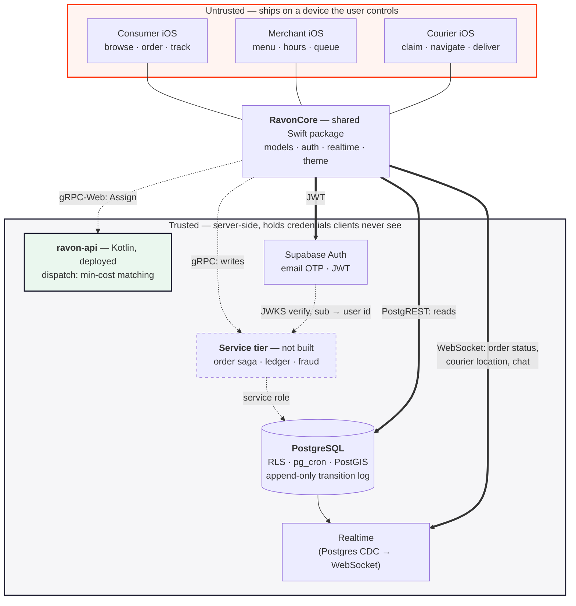

# Ravon

A three-sided food-delivery marketplace for Dushanbe, Tajikistan — consumer, merchant and
courier iOS apps over one shared Swift package, a PostgreSQL data model, and a dispatch
engine that assigns couriers to orders as a minimum-cost matching problem rather than a
first-come-first-served job board. This repository is `RavonCore`: the shared package, the
dispatch engine and its evaluation harness, the order lifecycle model, and the CI gates.
The dispatch service tier has been **extracted to Kotlin/gRPC and is deployed** at
[`ravon-api.fly.dev`](https://ravon-api.fly.dev); the order and ledger tiers are not.

The interesting part of a delivery marketplace is not the CRUD. It is deciding which
courier gets which order, proving that decision is correct, and measuring whether it is
actually better — under conditions you can state.

---

## Measured results

Every number below was produced by running the code in this repository. Each is stated
with the caveat that bounds it, because a number without its conditions is not a result.

### Dispatch: minimum-cost matching vs. greedy FCFS

30 seeds · 12 couriers · 240 orders · 180-minute window, in a deterministic simulator:

| metric | result |
|---|---|
| orders assigned to a courier | **+44.6%** (min +29.9%, max +53.8%) |
| mean **modeled** delivery time | **−45.3%** (range −51.7% to −39.7%) |
| total courier travel | −1.1% mean — but the worst seed is **+2.1%** |
| seeds where matching won | **30 / 30**, strictly |

**Caveat, and it is the important half: the advantage is a function of courier scarcity
and vanishes entirely once supply exceeds demand.** Holding demand at 240 orders, seed 42:

| couriers | greedy | matching | gain |
|---|---|---|---|
| 6 | 63 | 100 | **+58.7%** |
| 12 | 115 | 162 | +40.9% |
| 24 | 234 | 240 | +2.6% |
| 48 | 240 | 240 | **0.0%** |

This is a peak-load optimisation — worth a great deal at the dinner rush and nothing on a
slow Tuesday. It is pinned as a test so nobody later tunes dispatch for a regime where it
cannot matter.

**Second caveat: these are simulator numbers, not delivery times.** Distance is
straight-line Haversine with no road network, kitchen prep is drawn from a uniform
distribution, and couriers never decline an offer. The *comparison* is sound because both
strategies run in the identical world; the absolute minutes are not an ETA.

**Third caveat: "on less fuel" would be an overclaim.** The mean travel difference is
−1.1%, but the per-seed spread crosses zero. "No measurable travel penalty" is what the
data supports.

→ [Full study](docs/dispatch-engine.md) · [ADR 0002](docs/adr/0002-min-cost-matching-over-greedy.md)

### Experiment design: measuring the bias of A/B designs against ground truth

A simulator can do what production cannot — run the whole world on algorithm A, then on
algorithm B with the same seed, so the *true* effect is known and each experiment design's
bias can be measured rather than argued about.

| dispatch partition | true lift | naive A/B mean \|bias\| | switchback mean \|bias\| |
|---|---|---|---|
| none | 21.1 pts | 23.3 pts | 22.3 pts |
| 3×3 zones | 1.9 pts | **3.0 pts** | **3.3 pts** |

Both designs were initially biased by more than the entire effect they were estimating.
The cause was not interference between arms — it was a **granularity mismatch**: a batch
optimiser's effect is a property of the whole dispatch decision, so splitting orders
between arms measures a different algorithm. Making dispatch itself run per zone cut
absolute bias about **7×**.

**Caveat 1 — the negative result.** At this scale, once dispatch is zone-partitioned,
plain order-level randomisation is about as unbiased as a switchback. This does not
reproduce DoorDash's headline; it localises why switchbacks matter (densely coupled
markets with real carryover between time blocks, which 12 couriers over 9 zones is not).

**Caveat 2 — relative bias got *worse*.** Absolute bias fell 23.3 → 3.0 points, but the
true effect fell 21.1 → 1.9 at the same time. As a fraction of the effect, bias went from
~1.1× to ~1.6×.

**Caveat 3 — zones cost optimality.** That shrinking true effect is the third finding:
partitioning 3×3 cost most of the optimiser's advantage, because a courier cannot serve
an adjacent zone even when they are closest.

→ [Full study](docs/experiment-design-study.md) · [ADR 0004](docs/adr/0004-zone-partitioning.md)

### Correctness properties

| property | how it is established |
|---|---|
| The matcher returns the true optimum | exhaustive permutation search over 300 random matrices, exact equality |
| The order lifecycle graph is live | 17 property-based invariants over a declared 36-edge, 17-state, 4-actor transition table |
| The graph is cyclic, and termination is not free | Tarjan SCC pass found exactly one cycle — courier cancellation requeues the order — so termination depends on a server-side rate limit, which is now asserted |
| Simulations are reproducible | same seed ⇒ identical assignments, delivery times, travel and per-courier job counts |
| The Kotlin port did not change the algorithm | 30 seeds × 2 dispatchers × 11 metrics reproduced from the Swift original, doubles compared **bitwise** — 660 numbers, not a tolerance |
| An incompatible `.proto` change fails the build | `buf breaking` exits **100** on a renumbered or deleted field and **0** on an added one — measured, not assumed |

The lifecycle suite caught a modelling error in its own author's first version of the
transition table. That is the argument for declaring the state machine as data.

### Provenance of these numbers

The dispatch sources and their tests are committed and run in CI. Since
[`17b5db0`](https://github.com/mmarufov/ravon-core/commit/17b5db0) the engine is **Kotlin**,
and these figures are produced by `./gradlew :dispatch:test` — reproducing the Swift
original bit-for-bit, which is what makes them the same numbers rather than merely similar
ones.

Figures drifted while the simulator changed: an earlier draft of these docs recorded
+42.2% orders and "−1.4% courier travel". Both were superseded by measurement. The travel
figure was the misleading one — the mean is −1.06%, but the worst single seed is **+2.13%**,
so optimal matching sometimes drives *further*, and "no measurable travel penalty" is the
defensible claim rather than "less travel".

---

## Architecture

Solid lines exist. Dashed lines do not.


```mermaid
flowchart TB
    subgraph clients["Untrusted — ships on a device the user controls"]
        C["Consumer iOS<br/>browse · order · track"]
        M["Merchant iOS<br/>menu · hours · queue"]
        K["Courier iOS<br/>claim · navigate · deliver"]
    end

    CORE["<b>RavonCore</b> — shared Swift package<br/>models · auth · realtime · theme"]

    C --- CORE
    M --- CORE
    K --- CORE

    subgraph trusted["Trusted — server-side, holds credentials clients never see"]
        direction TB
        DISP["<b>ravon-api</b> — Kotlin, deployed<br/>dispatch: min-cost matching"]
        SVC["<b>Service tier</b> — not built<br/>order saga · ledger · fraud"]
        PG[("<b>PostgreSQL</b><br/>RLS · pg_cron · PostGIS<br/>append-only transition log")]
        RT["Realtime<br/>(Postgres CDC → WebSocket)"]
        AUTH["Supabase Auth<br/>email OTP · JWT"]

        SVC -.->|"service role"| PG
        PG --> RT
    end

    CORE ==>|"PostgREST: reads"| PG
    CORE ==>|"WebSocket: order status,<br/>courier location, chat"| RT
    CORE ==>|"JWT"| AUTH
    CORE -.->|"gRPC-Web: Assign"| DISP
    CORE -.->|"gRPC: writes"| SVC

    AUTH -.->|"JWKS verify, sub → user id"| SVC

    style trusted fill:#f6f6f8,stroke:#1A1A2E,stroke-width:2px
    style clients fill:#fff4f1,stroke:#FF3008,stroke-width:2px
    style SVC stroke-dasharray: 5 5
    style DISP fill:#eaf7ee,stroke:#1A1A2E,stroke-width:2px
```

Four things this diagram is trying to say:

1. **The trust boundary is the box, not the network hop.** Everything above it runs on
   hardware the user owns, so every value it sends is an assertion. The anon key it ships
   with is public client config; anything reachable with it must be safe against `curl`.
   Row-level security stays on after the service tier lands — it becomes defence in depth
   rather than the only gate.
2. **Two transports, on purpose.** Commands need global state and transactional integrity,
   so they go to the service tier. Reads and subscriptions stay on PostgREST and Postgres
   CDC because those already work and rebuilding them buys nothing. This is what an
   incremental extraction looks like partway through.
3. **Dispatch has moved server-side**, and the reason it went first is worth stating
   precisely. The usual framing — "it shipped in the client package, and a phone cannot
   see the other couriers" — was true about where the code sat and false about what was
   happening: *nothing called it*. It was a research artifact compiled into three app
   binaries as dead weight. The real reason it went first is that it had a **test oracle**
   — a complete reference implementation to diff against — so the port was provable and
   carried no regression risk. Only `Assign` is dashed-to here because no client generates
   against the contract yet.
4. **Realtime is change-data-capture, not a second source of truth.**

→ [Diagram notes](docs/architecture.md) · [ADR 0005](docs/adr/0005-extract-to-kotlin-not-rewrite.md)

---

## What's real, what's simulated, what's not built

Stating this boundary is the point. The dispatch numbers mean something specific and it
is easy to read them as meaning more.

### Real — code in this repository, exercised by tests

| | Evidence |
|---|---|
| Shared Swift package: models, auth, realtime, theme | `Sources/RavonCore/` — 43 files, 7,454 lines |
| Hungarian solver, verified optimal against brute force | `Dispatch/HungarianSolver.swift`, 300 matrices |
| Cost model with capped urgency and fairness credits | `Dispatch/Dispatcher.swift` |
| Deterministic marketplace simulator with latent state | `Dispatch/MarketplaceSimulator.swift` |
| Zone partitioning and the switchback harness | `Dispatch/{DispatchZone,SwitchbackExperiment}.swift` |
| 17-state, 36-edge, 4-actor declared transition table | `Models/OrderLifecycle.swift` |
| 17 property-based lifecycle invariants incl. Tarjan SCC | `Tests/.../OrderLifecycleInvariantTests.swift` |
| Email-OTP auth flow, typed errors, shared SwiftUI | `UI/Auth/` |
| Schema-drift and JWT-decoding credential CI gates | `scripts/` |
| **Kotlin dispatch service, deployed** | [`ravon-api.fly.dev`](https://ravon-api.fly.dev) — 2 machines, Frankfurt |
| **Bit-exact Kotlin port of the engine** | `services/dispatch/` — 660 baseline numbers matched exactly |
| **`Assign` over gRPC, gRPC-Web and Protobuf-JSON** | `services/server/` — Armeria, no Envoy |
| **Proto contract + `buf breaking` gate** | `proto/`, CI job `proto-contract` |
| **181 tests, all passing** | 142 Swift (`swift test`) + 39 Kotlin (`./gradlew test`) |
| **Double-entry ledger in PostgreSQL** | `db/ledger/`: integer minor units, balanced at COMMIT by a deferred constraint trigger, idempotent posting by key. 85 tests; a Hypothesis state machine makes 1,019 postings, and 7 tests kill 18 backends mid-transaction (`KILL-TESTS 7 of 85; total kills 18`, printed by the suite). CI job `ledger-invariants`. Local PostgreSQL only; it is not wired to orders, whose money is still `numeric(10,2)` |
| **The authored database schema** | `db/schema/`: 16 tables, the 36-edge transition table enforced by a trigger, every RPC the apps call. Applied to a fresh PostgreSQL 17 in CI and checked by `invariants.sql` (CI job `db-invariants`). Runs locally; there is no hosted instance |
| **Probabilistic ETA and anomaly detection** | `ml/`: a pytest suite and a report-drift gate (CI job `ml-evaluation`). Measured on simulated orders only, and **no app uses it**: the consumer ETA is still haversine distance over a fixed speed |
| **Payout saga, hand-built vs Temporal** | `db/temporal_payout/`: the same crash matrix against both, on a Temporal dev server (CI job `temporal-payout`). Never run against a production Temporal cluster. A lost provider reply is handled status-first: in a simulated, pre-registered matrix (4 strategies x 6 fault modes x 200 seeds) it had 0 double or orphaned payouts in 1,200 runs, where failing on the timeout had 600. [Details](db/temporal_payout/README.md#when-the-providers-reply-is-lost) |

### Simulated — real code, synthetic world

| | What that means |
|---|---|
| Every dispatch and experiment number in this README | Produced by `MarketplaceSimulator`, not by couriers |
| Travel time | Haversine ÷ a fixed speed. No roads, no traffic, no turns |
| Kitchen prep time | Uniform random, not learned |
| Courier behaviour | An assigned courier always accepts. Real couriers decline |
| Order arrivals | Synthetic, clustered around a modelled city centre |

### Not built

| | Status |
|---|---|
| Order and ledger service tiers | Only `dispatch` is extracted. [ADR 0005](docs/adr/0005-extract-to-kotlin-not-rewrite.md) |
| JWT interceptor on the service | `Assign` is pure computation and unauthenticated; the first authenticated RPC lands with the ledger tier |
| `GetOffer` — the per-courier offer projection | Declared in the contract, returns `UNIMPLEMENTED`. It needs order state. It exists in `v1` now so the gate guards it from the start |
| The apps calling the service | The engine is live and the contract is fixed; no client generates against it yet |
| The ledger wired to orders | The ledger is tested on its own. Order totals are `numeric(10,2)` and the apps decode `Double` |
| ML in the product | The ETA model is evaluated offline; the apps do not call it |
| Demand forecasting | Not built |
| Batching (multiple orders per courier) | Not modelled — the largest gap vs. the reference architecture |
| Courier acceptance probability | Not modelled. There is no `courier_decline_order` RPC |
| Dispatch wired to the app | The engine and its evaluation exist; no `dispatch_tick`, still `claim_order` |

### One service runs. There is no hosted database.

The dispatch service is live at [`ravon-api.fly.dev`](https://ravon-api.fly.dev) — which is
possible precisely because `Assign` is **pure computation**: couriers and orders in,
assignments out, no persistence and no auth. That is why it was extracted first.

Everything that needs storage is still blocked. **The Supabase project behind this system
was deleted** — the host returns NXDOMAIN and the Management API returns 404 "Resource has
been removed" for the project ref. The three iOS apps remain backend-less and nothing here
can be run against live data.

```
$ curl https://ravon-api.fly.dev/health
{"healthy":true}

$ curl -X POST https://ravon-api.fly.dev/ravon.dispatch.v1.DispatchService/Assign \
    -H 'Content-Type: application/json' -d @batch.json
{"assignments":[
  {"courierId":"…c0de-0","orderId":"…0dde-1","costMinutes":-23.976121668543847},
  {"courierId":"…c0de-1","orderId":"…0dde-0","costMinutes":-10.989687123474436}]}
```

That response is worth reading closely: courier 0 is *nearer* order 0, and the matcher
crossed them anyway, because order 1 is older and its urgency credit outweighs the extra
distance. Negative costs are the credits applied. That crossing is the entire reason the
matcher exists — a greedy dispatcher cannot produce it.

Consequences still worth knowing:

- The 19 original SQL migrations were an incomplete record even when the project existed:
  14 of 15 tables touched by Swift were never created by a migration, and six Postgres
  enums were created through the dashboard. They now live in `db/migrations/`, tracked.
- The schema has been rebuilt under `db/schema/` from the union of migrations, Swift
  `Codable` models and call sites. It applies to a local PostgreSQL 17 and CI asserts its
  invariants, but no hosted database runs it, so the apps still have nothing to talk to.
- `scripts/schema_drift.py` reports 15 unverified findings, and that number is a **floor**:
  its `case` parser reads only the first identifier per line, so it is blind to 36 of 265
  wire keys — including `Profile.role` and `MenuItem.price`.

The best incident story in the project came from this: when the backend disappeared, the
apps rendered "backend deleted" and "no orders today" identically. A typed service state
that distinguishes *degraded* from *empty* is the fix, and it is not built either.

---

## Running it

```bash
swift build
swift test                                  # 142 tests: 81 XCTest + 61 swift-testing

cd services && ./gradlew test               # 36 Kotlin tests
```

Targeted suites:

```bash
swift test --filter 'OrderLifecycle'                    # 17 — state-machine invariants
cd services
./gradlew :dispatch:test --tests '*DispatchBaselineTest' #  7 — 30-seed bit-exact baseline
./gradlew :dispatch:test --tests '*HungarianSolverTest'  #  7 — incl. 300-matrix optimality
./gradlew :dispatch:test --tests '*Switchback*'          #  7 — experiment-design bias
./gradlew :server:test                                   #  7 — Assign over the wire
```

Run the service locally, and call it:

```bash
cd services && ./gradlew :server:run         # :8080
curl localhost:8080/health
open http://localhost:8080/docs              # Armeria's RPC explorer
```

Swift side requires Swift 5.9+, iOS 17+ / macOS 14+, with
[`supabase-swift`](https://github.com/supabase/supabase-swift) the only third-party
dependency. Kotlin side needs a **JDK 22 or newer** — `Libm` reaches the platform libm
through the FFM API, which was still a preview feature in 21.

### CI gates

Ten jobs in `.github/workflows/ci.yml`. Each exists because of a
specific class of defect:

| job | catches |
|---|---|
| `test` | ordinary regressions, across the whole Swift suite |
| `lifecycle-invariants` | a state-machine change that breaks liveness or visibility — a marketplace correctness bug, not a flaky test |
| `dispatch-quality` | dispatch getting worse for real couriers, which no unit test would notice. Runs the Kotlin engine **and** the over-the-wire server suite |
| `proto-contract` | an incompatible schema change reaching a shipped iOS app, which has no forced-upgrade path. `buf lint` + `buf breaking` against `main` |
| `schema-drift` | Swift `CodingKeys` diverging from the SQL columns. Not a compile error, not a test failure — a **decode crash in a shipped iOS app** |
| `ledger-invariants` | money conservation, enforced by a deferred constraint trigger rather than application code, including under killed backends. Fails if the server stops counting exactly 18 kills in 7 tests |
| `temporal-payout` | the Temporal payout saga paying twice or losing a payout when workers are SIGKILLed or frozen mid-activity. Runs its suite and the hand-built vs Temporal crash matrix once |
| `ml-evaluation` | an ML method that stops behaving, or a README/FINDINGS number that no longer matches what the code produces |
| `db-invariants` | a grant, policy, constraint or generated column that drifted from the security rules, asserted against a freshly applied PostgreSQL 17 |
| `secret-scan` | a committed `service_role` JWT, which would be a full database compromise. Decodes every JWT and inspects the `role` claim rather than grepping for a word that legitimately appears in docs |

**A gate nobody has watched fail should not be trusted**, and this repository has direct
evidence for why. `schema-drift` was *structurally incapable of passing* from the day it
was written — it read a gitignored directory — and nobody noticed for months, because CI
had never executed at all. Both are fixed; the lesson is kept.

So `proto-contract` was proven by breaking it on purpose:

| change | `buf breaking` |
|---|---|
| renumber a field | exit **100** |
| delete a field | exit **100** |
| **add** a field | exit **0** — additive changes stay allowed |

Both scripts also run locally:

```bash
python3 scripts/schema_drift.py    # 0 drift, 15 unverified — a floor, see above
python3 scripts/scan_secrets.py .  # clean
```

---

## Deliberately not built

Each rejection carries the threshold that would reverse it, because a rejection without a
threshold is an excuse. Full reasoning in
[ADR 0007](docs/adr/0007-rejected-technologies.md).

| | Why not | Would become justified when |
|---|---|---|
| **Gurobi** | Single-order assignment is solved *exactly* by the Hungarian algorithm in microseconds; a commercial solver cannot beat optimal | Batching enters the model — then it is a vehicle-routing problem and the exact algorithm no longer applies. Try OR-Tools first |
| **Kafka** | The guarantees — durability, ordering, replay, fan-out — are implemented on an append-only Postgres table plus CDC. Transactional emission is *better* this way: one write, no outbox | Multiple extracted services exchanging events, or sustained rates above ~5,000/s. Current arithmetic: ~2.5/s |
| **Cassandra** | Every entity needs multi-row transactions; the ledger wants a deferred constraint at COMMIT, which has no Cassandra equivalent | Write throughput one tuned Postgres primary cannot absorb, after partitioning and read replicas |
| **Service mesh** | One deployable today, at most four after the extraction. gRPC's own TLS, deadlines and retries cover it in config | ~10+ services, or more than two languages in the service tier |
| **Feature store** | It prevents training/serving skew. There is no serving path, so skew cannot occur | The same feature is computed in both an offline job and an online request path |
| **Bazel** | ~7,500 lines in one SwiftPM target; a clean build is seconds | CI wall-clock consistently over ~15 min with no cheaper fix left |

The **monorepo** idea is separately correct and is being adopted; a distributed build
system is a different decision that often gets conflated with it.

---

## Porting an algorithm without changing it

The Kotlin engine had to reproduce the Swift original **exactly**, not approximately —
otherwise every measured claim above would quietly become a claim about different code.
The bar was all 660 baseline numbers, compared bitwise. Three things had to be right, and
none of them was visible before the fixture demanded them:

**Swift's random range-mapping is not one algorithm.** SplitMix64 transcribes in ten
lines. The mapping from 64 raw bits into a range does not: `next(upperBound:)` takes a
**power-of-two fast path** that masks low bits, and otherwise uses **Lemire's
nearly-divisionless** method. Implementing either alone fails — five golden vectors match
Lemire, and the sixth, whose bound is exactly 2⁵³, only matches the mask.

**`Math.sin` is not `sin`.** Measured over 600 bearings drawn from the simulator's own
generator:

| implementation | disagrees with Swift |
|---|---|
| `Math.sin` / `Math.cos` | **20.3%** of inputs |
| `StrictMath.sin` / `StrictMath.cos` | **9.0%** |
| platform libm via the FFM API | **0%** |

One ULP sounds ignorable. It is not: the simulator feeds these into a cost comparison, and
a last-bit flip near a tie changes which courier wins an assignment.

**Swift's `Date` epoch is 2001, not 1970.** `Date` stores
`timeIntervalSinceReferenceDate`, so the cost model's arithmetic happens at magnitude
7.2 × 10⁸ rather than 1.7 × 10⁹ — and a double has different residual precision at each.
Using the Unix value produced costs wrong in the *ninth decimal*, which flipped one greedy
tie and lost exactly one assignment on seed 1 (109 against the recorded 110).

None of these is findable by reading the code carefully. Each was found by a fixture that
refused to accept "close enough" — which is the argument for setting the bar at bitwise in
the first place.

One divergence remains and is documented rather than hidden: the Box-Muller gaussian is
1 ULP off and cannot be closed. It is unreachable in the verified regime, because
`gaussian` short-circuits at `sigma <= 0` and the baseline configuration has every sigma
zero — a dedicated test pins exactly that, so removing the short-circuit fails loudly.
Under latent noise, compare distributions rather than bits.

---

## Architecture Decision Records

Each one states the problem, the options weighed, what was chosen, and what it cost.

| # | Decision |
|---|---|
| [0001](docs/adr/0001-order-lifecycle-as-declared-data.md) | Model the order lifecycle as declared data, not scattered status checks |
| [0002](docs/adr/0002-min-cost-matching-over-greedy.md) | Solve dispatch as minimum-cost matching, and do not minimise distance |
| [0003](docs/adr/0003-deterministic-simulation-as-evaluation.md) | Evaluate dispatch by deterministic simulation, with latent state |
| [0004](docs/adr/0004-zone-partitioning.md) | Zone partitioning: tractability *and* measurability, at a real cost |
| [0005](docs/adr/0005-extract-to-kotlin-not-rewrite.md) | Extract a Kotlin service tier; do not rewrite the backend — **dispatch tier built and deployed; order and ledger tiers not** |
| [0006](docs/adr/0006-postgres-over-kafka.md) | Implement the event guarantees on Postgres, not on Kafka |
| [0007](docs/adr/0007-rejected-technologies.md) | Technologies deliberately not used, and what would change that |
| [0008](docs/adr/0008-proto-contract-and-compatibility-gate.md) | The `.proto` files are the contract, and a gate enforces it |

## Further reading

- [Dispatch engine — design, results, limitations](docs/dispatch-engine.md)
- [Experiment design under interference](docs/experiment-design-study.md)
- [DeepRed — what DoorDash runs, and how Ravon compares](docs/deepred-research.md)
- [Architecture diagram and notes](docs/architecture.md)

## Using the package

```swift
import RavonCore

RavonCore.configure(
    supabaseURL: URL(string: "https://YOUR-PROJECT.supabase.co")!,
    supabaseAnonKey: "YOUR_ANON_KEY"   // inject from .xcconfig / Secrets.plist / CI secret
)
```

Configure once at launch, before any service is touched. The anon key is public client
config, but credentials still do not belong in source control — which is what the
`secret-scan` gate enforces. A `service_role` key must never appear in client code, a
mobile binary, tracked docs or repo config, including in a private repo.

UI strings are Russian (Cyrillic). Brand colour is `#FF3008`.
