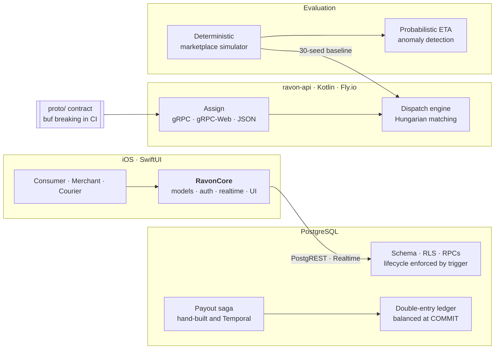

# Ravon

Food delivery for Dushanbe, Tajikistan, built around three hard problems: which courier
gets which order, money that cannot be lost or paid twice, and a checkout that cannot sell
more food than the kitchen has.

[](https://github.com/mmarufov/ravon-core/actions/workflows/ci.yml)
[](https://ravon-api.fly.dev/health)


Ravon is three iOS apps (consumer, merchant, courier) on one shared Swift package, a Kotlin
dispatch service, and a PostgreSQL core. This repository contains everything except the
app screens: the shared package, the dispatch engine and service, the database schema,
ledger and payout saga, the ML layer, and the CI gates that hold all of it to its claims.

## Highlights

| Area | Result |
|---|---|
| **Dispatch** | Minimum-cost matching assigns **+44.6%** more orders than greedy first-come-first-served and cuts modeled delivery time by **45.3%**. It wins on **30 of 30** seeds. [→](#dispatch-is-a-matching-problem) |
| **Cross-language port** | The engine was ported from Swift to Kotlin with **660 of 660** baseline metrics identical, compared bit for bit, not within a tolerance. [→](#porting-an-algorithm-without-changing-it) |
| **Ledger** | PostgreSQL rejects any transaction where debits ≠ credits, at COMMIT. It holds with **18** database backends killed mid-transaction. [→](#money-is-enforced-by-the-database) |
| **Payouts** | When the payment provider's reply is lost: **0** wrong-money outcomes in 1,200 simulated runs, against 600 for failing on the timeout. [→](#money-is-enforced-by-the-database) |
| **Checkout** | 1,000 simultaneous pre-orders for 40 portions: **1,000** went live before the fix, exactly **40** after it. [→](#a-checkout-that-cannot-oversell) |
| **ETA** | A probabilistic (Weibull) delivery-time model cuts CRPS by **55.8%** against the naive formula, and its p80 quote is on time **80.4%** of the time. [→](#probabilistic-eta) |

Ravon has not launched. Marketplace numbers come from a deterministic simulator, and each
section links the command that reproduces them.

## Try it

The dispatch service is deployed. This batch has two couriers and two orders:

```bash
curl -s https://ravon-api.fly.dev/ravon.dispatch.v1.DispatchService/Assign \
  -H 'Content-Type: application/json' -d '{
  "now": "2026-10-01T12:00:00Z",
  "couriers": [
    {"courierId": "00000000-0000-0000-0000-00000000000a",
     "location": {"latitude": 38.56, "longitude": 68.770},
     "idleSince": "2026-10-01T11:50:00Z"},
    {"courierId": "00000000-0000-0000-0000-00000000000b",
     "location": {"latitude": 38.56, "longitude": 68.862},
     "idleSince": "2026-10-01T11:50:00Z"}
  ],
  "orders": [
    {"orderId": "00000000-0000-0000-0000-000000000001",
     "createdAt": "2026-10-01T11:45:00Z", "readyAt": "2026-10-01T12:10:00Z",
     "pickup": {"latitude": 38.56, "longitude": 68.793},
     "dropoff": {"latitude": 38.57, "longitude": 68.80}},
    {"orderId": "00000000-0000-0000-0000-000000000002",
     "createdAt": "2026-10-01T11:58:00Z", "readyAt": "2026-10-01T12:10:00Z",
     "pickup": {"latitude": 38.56, "longitude": 68.760},
     "dropoff": {"latitude": 38.55, "longitude": 68.75}}
  ]
}'
```

```json
{"assignments": [
  {"courierId": "…000a", "orderId": "…0002", "costMinutes": 7.705273374457107},
  {"courierId": "…000b", "orderId": "…0001", "costMinutes": -2.2762166585692505}
]}
```

Courier A is 2 km from the older order 1 and 0.9 km from order 2. Courier B is 6 km from
order 1 and 8.9 km from order 2, outside the 8 km radius. A greedy dispatcher serves the
oldest order first with its nearest courier, so it sends A to order 1 and order 2 waits
with nobody left to reach it. The matcher solves the whole batch at once and serves both.
A cost goes negative when an order's waiting time and a courier's idle time are credited
back, which is how a stale order outranks a cheap new one.

The same endpoint speaks gRPC, gRPC-Web and Protobuf-JSON. `GET /health` returns
`{"healthy":true}`.

## Architecture


```mermaid
flowchart LR
    subgraph clients["iOS · SwiftUI"]
        direction TB
        APPS["Consumer · Merchant · Courier"]
        CORE["<b>RavonCore</b><br/>models · auth · realtime · UI"]
        APPS --> CORE
    end

    subgraph data["PostgreSQL"]
        direction TB
        SCHEMA["Schema · RLS · RPCs<br/>lifecycle enforced by trigger"]
        SAGA["Payout saga<br/>hand-built and Temporal"]
        LEDGER["Double-entry ledger<br/>balanced at COMMIT"]
        SAGA --> LEDGER
    end

    subgraph service["ravon-api · Kotlin · Fly.io"]
        direction TB
        API["Assign<br/>gRPC · gRPC-Web · JSON"]
        ENG["Dispatch engine<br/>Hungarian matching"]
        API --> ENG
    end

    subgraph eval["Evaluation"]
        direction TB
        SIM["Deterministic<br/>marketplace simulator"]
        ML["Probabilistic ETA<br/>anomaly detection"]
        SIM --> ML
    end

    CORE -->|"PostgREST · Realtime"| SCHEMA
    PROTO[["proto/ contract<br/>buf breaking in CI"]] --> API
    SIM -->|"30-seed baseline"| ENG
```

- **The client is untrusted.** Each app ships the public anon key, so every policy and RPC
  that key can reach is written to be safe against direct `curl`. Row-level security,
  column grants and `SECURITY DEFINER` RPCs carry the authorization, and the
  `db-invariants` CI job checks them against a freshly applied database.
- **The order lifecycle is data.** It has 17 states, 36 edges and 4 actors, declared once
  in `OrderLifecycle.swift` and enforced by a trigger in `db/schema/03_lifecycle.sql`.
  A transition that is not in the table cannot be written.
- **Dispatch was extracted first** because it is pure computation (couriers and orders in,
  assignments out) and because the Swift original served as a test oracle. That made the
  port provable before anything stateful moved.
- **Events stay in Postgres.** Durability, ordering and replay come from an append-only
  transition table plus change data capture, so state and its event are a single write
  with no outbox. ([ADR 0006](docs/adr/0006-postgres-over-kafka.md))

## Engineering notes

### Dispatch is a matching problem

Greedy dispatch hands the oldest order to the nearest courier, one order at a time.
Ravon's engine solves each batch as a minimum-cost bipartite matching (Hungarian
algorithm, Jonker–Volgenant form). The cost is deliberately not distance. It is minutes of
travel plus time spent waiting at the restaurant, minus capped credits for how long an
order has waited and how long a courier has been idle. Pure distance minimization starves
couriers on the edge of town and lets old orders lose forever to newer, closer ones.

The simulator ran 30 seeds with 12 couriers, 240 orders and a 180-minute window:

| metric | matching vs greedy |
|---|---|
| orders assigned | **+44.6%** (range +29.9% to +53.8%) |
| mean modeled delivery time | **−45.3%** (range −51.7% to −39.7%) |
| total courier travel | −1.1% mean; worst seed +2.1% |

The gain depends on how scarce couriers are. With demand fixed at 240 orders:

| couriers | 6 | 12 | 24 | 48 |
|---|---|---|---|---|
| gain in orders assigned | **+58.7%** | +40.9% | +2.6% | 0.0% |

So this is a peak-load optimization: it matters a great deal at the dinner rush and not at
all on a slow afternoon. A test pins this curve so nobody tunes dispatch for a regime
where it cannot help. The solver matches exhaustive search on 300 random matrices.
Both strategies run in an identical simulated world, so the comparison is fair, but the
absolute minutes are not real ETAs: travel is straight-line distance and couriers always
accept.
→ [Study](docs/dispatch-engine.md) · [ADR 0002](docs/adr/0002-min-cost-matching-over-greedy.md)

**Measuring the experiment, too.** A simulator can run the same world under both
algorithms, so the true effect is known and an A/B design's bias can be measured directly.
Both naive A/B and switchback designs started out biased by more than the effect they were
estimating. The cause was not interference between arms. It was a granularity mismatch:
a batch optimizer's effect belongs to the whole dispatch decision, so splitting orders
between arms measures a different algorithm. Partitioning dispatch into zones cut absolute
bias from 23.3 to 3.0 points. The price is that a courier can no longer serve the
neighboring zone, which gives up most of the optimizer's advantage. ADR 0004 weighs that
trade.
→ [Study](docs/experiment-design-study.md) · [ADR 0004](docs/adr/0004-zone-partitioning.md)

### Porting an algorithm without changing it

The Kotlin engine had to reproduce the Swift original exactly. Otherwise every number above
would describe different code. The bar was 30 seeds × 2 dispatchers × 11 metrics, with
doubles compared bitwise. Three problems were invisible in the code and only surfaced
because the fixture refused to accept "close enough":

- **Swift's random range mapping is two algorithms.** `next(upperBound:)` masks low bits
  for power-of-two bounds and uses Lemire's nearly-divisionless method otherwise.
  Implementing only one of them fails.
- **`Math.sin` is not `sin`.** Over 600 bearings from the simulator's own generator:

  | implementation | disagrees with Swift |
  |---|---|
  | `Math.sin` / `Math.cos` | 20.3% |
  | `StrictMath.sin` / `StrictMath.cos` | 9.0% |
  | platform libm through the FFM API | **0%** |

  A 1-ULP difference near a tie changes which courier wins.
- **Swift's `Date` epoch is 2001, not 1970.** At Unix magnitudes a double keeps different
  residual precision. Costs drifted in the ninth decimal, flipped one greedy tie, and lost
  one assignment on seed 1.

One divergence is still open. Box–Muller is 1 ULP off, and that path is unreachable at the
baseline configuration (every sigma is zero). A dedicated test pins that, so the gap
cannot widen silently. → [ADR 0005](docs/adr/0005-extract-to-kotlin-not-rewrite.md)

### Money is enforced by the database

**Ledger.** Amounts are stored in integer minor units, and postings are idempotent by key.
A `DEFERRABLE INITIALLY DEFERRED` constraint trigger checks at COMMIT that debits equal
credits. Deferral is the design: a posting is unbalanced between its first leg and its
last, so an immediate check would push the balance logic back into application code. The
suite has 85 tests, including a Hypothesis state machine that makes 1,019 postings. Seven
tests kill PostgreSQL backends mid-transaction, 18 kills in total. The kill count is read
server-side from `pg_stat_database`, so the harness cannot overstate it.
→ [`db/ledger`](db/ledger/README.md)

**Payouts when the provider's reply is lost.** After a timeout, the money may have moved,
may be pending, or may never have arrived, and both retrying and giving up can be wrong.
Ravon marks the payout `unknown`, asks the provider for its status, and branches on the
answer. A `CHECK` constraint makes "failed without a verdict" impossible to store. Four
strategies were compared across 6 fault modes and 200 seeds, with the design
pre-registered in a commit before the harness existed:

| strategy | wrong-money outcomes |
|---|---|
| retry with a fresh request id | 600 / 1,200 |
| fail on timeout | 600 / 1,200 |
| retry with the same request id | 200 / 1,200 (all after the provider's key expired) |
| **status first** | **0 / 1,200** |

The same saga also runs on Temporal, through the same crash matrix as the hand-built
version, with workers SIGKILLed and frozen mid-activity. Either way, the safety of a
re-run comes from Postgres: `ON CONFLICT`, idempotent transitions, and one ledger key per
payout. → [`db/temporal_payout`](db/temporal_payout/README.md#when-the-providers-reply-is-lost)

### A checkout that cannot oversell

A rush harness fires K simultaneous checkouts at the real `create_order` and at four
concurrency strategies, with latency injected by Toxiproxy. It found that the order-now path
held, but scheduled pre-orders did not reserve stock at checkout: 1,000 pre-orders for 40 portions all went
live, in 10 of 10 runs. The fix reserves stock and a kitchen slot at checkout through a
stock ledger, releasing each at most once. After the fix, exactly 40 sell.

| strategy | runs that oversold |
|---|---|
| read, then write | **60 / 60** |
| row lock · conditional decrement · reservation rows | **0 / 180** |

The real `create_order` served 1,000 simultaneous buyers at a p99 of 288 ms on a laptop.
CI fails if any safe strategy oversells. It also fails if the unsafe one stops
overselling, because a harness that can no longer catch the bug proves nothing.
→ [Results](db/rush/RESULTS.md)

### Probabilistic ETA

The model predicts a three-parameter Weibull over delivery time, fitted by interval
regression, scored by CRPS, and turned into a customer quote by a separate decision layer
with an explicit cost of being late. On 46,329 simulated orders held out by whole day:

| model | MAE (min) | CRPS (min) |
|---|---|---|
| naive `prep + travel` | 37.18 | 37.18 |
| conditional Weibull, at order creation | 23.55 | **16.42** |

Its p80 quote is on time 80.4% of the time against a nominal 80%. On synthetic data the
fit recovers a known shape parameter of 3.37 to within 0.8%.
→ [`ml/`](ml/README.md) · [Findings](ml/FINDINGS.md)

## CI

Eleven jobs run on every push. Each one exists to catch a specific class of defect.

| job | fails when |
|---|---|
| `test` | the Swift suite regresses |
| `lifecycle-invariants` | a state-machine change breaks liveness or visibility, checked by 17 property-based invariants and a Tarjan SCC pass |
| `dispatch-quality` | the Kotlin engine drifts from the 660-number baseline, or the over-the-wire `Assign` suite fails |
| `proto-contract` | a `.proto` change would break a shipped app. `buf breaking` exits 100 on a renumbered or deleted field and 0 on an added one |
| `schema-drift` | Swift `CodingKeys` diverge from SQL columns, which would otherwise surface as a decode crash in a shipped app |
| `db-invariants` | a grant, policy or constraint drifts from the security rules on a fresh PostgreSQL 17 |
| `ledger-invariants` | money stops balancing, or the suite stops killing exactly 18 backends |
| `temporal-payout` | the Temporal saga pays twice or loses a payout under worker crashes |
| `rush-invariants` | a checkout oversells, or the deliberately unsafe strategy stops overselling |
| `ml-evaluation` | a model misbehaves, or a published number no longer matches the code |
| `secret-scan` | a `service_role` JWT is committed. It decodes every JWT and checks the role claim |

## Design decisions

Each ADR records the problem, the options considered, and what the choice cost.

| ADR | Decision |
|---|---|
| [0001](docs/adr/0001-order-lifecycle-as-declared-data.md) | The order lifecycle is declared data, not scattered status checks |
| [0002](docs/adr/0002-min-cost-matching-over-greedy.md) | Dispatch is minimum-cost matching, and it does not minimize distance |
| [0003](docs/adr/0003-deterministic-simulation-as-evaluation.md) | Dispatch is evaluated by deterministic simulation with latent state |
| [0004](docs/adr/0004-zone-partitioning.md) | Zone partitioning buys tractability and measurability, at a real cost |
| [0005](docs/adr/0005-extract-to-kotlin-not-rewrite.md) | Extract a Kotlin service tier incrementally rather than rewrite |
| [0006](docs/adr/0006-postgres-over-kafka.md) | Event guarantees come from Postgres, not Kafka |
| [0007](docs/adr/0007-rejected-technologies.md) | Technologies deliberately not used, and what would change that |
| [0008](docs/adr/0008-proto-contract-and-compatibility-gate.md) | The `.proto` files are the contract, and a gate enforces it |

Some tools were left out on purpose, and each has a stated condition for revisiting it:

| not used | why | revisit when |
|---|---|---|
| Kafka | An append-only table plus CDC gives durability, ordering and replay in one transactional write | several services exchange events, or sustained rates pass ~5,000/s |
| Gurobi | The Hungarian algorithm solves single-order assignment exactly | batching turns it into vehicle routing (OR-Tools first) |
| Cassandra | The ledger needs multi-row transactions and a deferred check at COMMIT | one tuned Postgres primary cannot absorb the writes |
| Service mesh | gRPC already provides TLS, deadlines and retries in config | roughly 10+ services |

## Running it

```bash
swift test                          # 142 tests: shared package + Swift reference engine
cd services && ./gradlew test       # 39 tests: Kotlin engine + server (JDK 22+)
./gradlew :server:run               # local service on :8080, RPC explorer at /docs
```

The database suites run against any local PostgreSQL 16+ and create and drop their own
databases. Setup is in [`db/ledger`](db/ledger/README.md), [`db/schema`](db/schema/README.md),
[`db/rush`](db/rush/README.md) and [`ml/`](ml/README.md).

The Kotlin side needs JDK 22 or newer because `Libm` calls the platform libm through the
FFM API.

<details>
<summary>Using RavonCore in an app</summary>

```swift
import RavonCore

RavonCore.configure(
    supabaseURL: URL(string: "https://YOUR-PROJECT.supabase.co")!,
    supabaseAnonKey: "YOUR_ANON_KEY"   // inject from .xcconfig or a CI secret
)
```

Call `configure` once at launch, before using any service. Requires Swift 5.9+ and
iOS 17+ / macOS 14+. UI strings are in Russian.

</details>

## Repository layout

```
Sources/RavonCore/   shared Swift package; Dispatch/ is the reference engine
services/            Kotlin: dispatch/ engine, server/ gRPC service (deployed to Fly.io)
proto/               the versioned service contract
db/schema/           PostgreSQL schema, RLS, RPCs, lifecycle trigger
db/ledger/           double-entry ledger and payout saga
db/temporal_payout/  the same saga on Temporal, plus the lost-reply matrix
db/rush/             concurrent-checkout harness and results
ml/                  probabilistic ETA and anomaly detection
docs/adr/            architecture decision records
scripts/             schema-drift and secret-scan gates
```

## What's next

- Generate clients from `proto/` and drive assignment through `Assign` instead of
  first-tap claiming.
- Put orders on the ledger. Order totals are still `numeric(10,2)`.
- Add batching (several orders per courier) and courier accept/decline to the simulator.
  These are the two biggest gaps against production dispatch systems.
- Add authentication to the service. It arrives with the first stateful RPC.

## Further reading

- [Dispatch engine: design, results, limitations](docs/dispatch-engine.md)
- [Experiment design under interference](docs/experiment-design-study.md)
- [How DoorDash's dispatch works, and how Ravon compares](docs/deepred-research.md)
- [Architecture notes](docs/architecture.md)

---

Built by [Muhammadjon Marufov](https://github.com/mmarufov).
