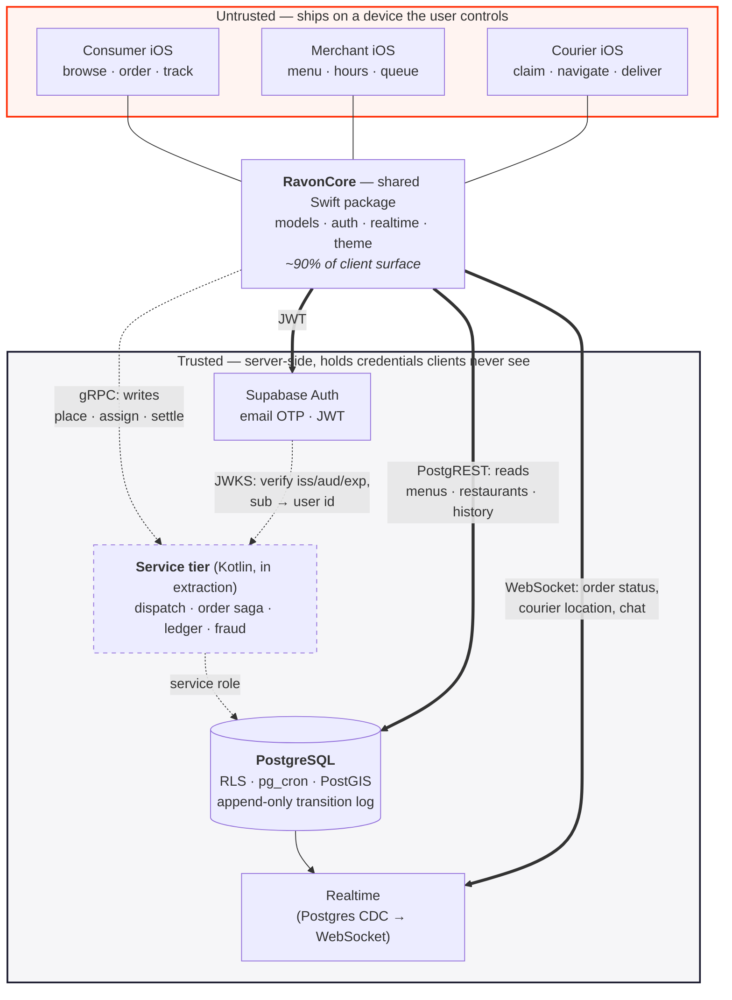

# Architecture

One diagram. It is deliberately small enough to redraw on a whiteboard in five minutes,
because that is what it is for.

**Solid lines exist today. Dashed lines do not** — the service tier is in extraction and
the Supabase project behind the right-hand side has been deleted. See
[what is real](../README.md#whats-real-whats-simulated-whats-not-built).

## Reading it

**The trust boundary is the box, not the network hop.** Everything in the top box runs on
hardware the user owns, so every value it sends is an assertion, not a fact. The anon key
it ships with is public client config; anything reachable with it must be safe against
someone calling the API directly with `curl`. That is why RLS stays on even after the
service tier lands — it becomes defence in depth behind the service rather than the only
gate.

**Two transports, on purpose.** Commands (place an order, assign a courier, move money)
go over gRPC to the service tier because they need global state and transactional
integrity. Reads and subscriptions stay on PostgREST and Supabase Realtime because a
generated typed client and a working Postgres-CDC websocket already exist and rebuilding
them buys nothing. This is what an incremental extraction looks like partway through; see
[ADR 0005](adr/0005-extract-to-kotlin-not-rewrite.md).

**One identity, two transports.** The clients hold a Supabase JWT. The service tier
verifies it against Supabase's JWKS endpoint and connects to Postgres as its own role —
not as the end user — which is how it can write rows clients cannot.

**Dispatch does not belong on a phone.** It currently lives in `Sources/RavonCore/Dispatch/`,
which is a layering error stated plainly: a courier's phone cannot see the other couriers,
and minimum-cost matching is meaningless without them. It sits there because that is where
it could be built and measured; it is the first thing that moves. See
[ADR 0005](adr/0005-extract-to-kotlin-not-rewrite.md).

## The five things to say out loud when drawing it

1. Three clients, one shared package — the apps are thin.
2. The line around the server side is a trust boundary, and the clients are outside it.
3. Writes go through a service that owns global state; reads go straight to Postgres.
4. Realtime is Postgres change-data-capture, not a second source of truth.
5. Auth is one identity provider; the service verifies, it does not issue.
